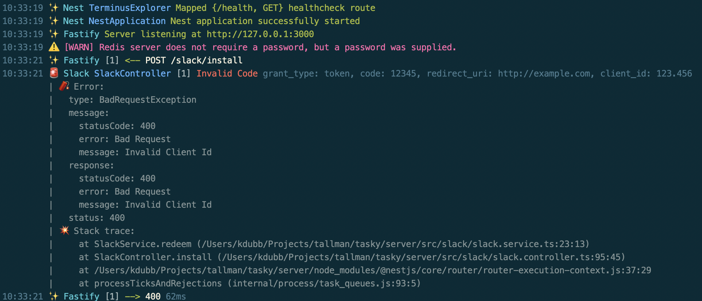

# miami-vice 🍹+🍓
[![npm version][1]][2]

A cute & powerful [ndjson](http://ndjson.org) formatter for [pino](https://github.com/pinojs/pino).

Heavily inspired by [pino-colada](https://github.com/lrlna/pino-colada) with lots of error & debug formatting mixed in.

For those of you wondering... a Miami Vice is half Piña Colada and half Strawberry Daiquiri 😉



# Usage

### Pipe Output (recommended)
Pipe a server that uses pino into miami-vice for logging.

```bash
node server.js | miami-vice
```

### In Process (as a [prettifier](http://getpino.io/#/docs/pretty?id=api-example))

 ```javascript
const pino = require('pino');
const logger = pino({
    prettyPrint: true,
    prettifier: require('miami-vice')
});
```


## miami-vice
After parsing input from `server.js`, miami-vice returns a stream and pipes it
over to `process.stdout`. It will output a timestamp, a log level in a form of
an emoji, and a message.

For `warn`, `error` and `fatal` log levels any log record properties that are not automatically handled are printed
after the primary log message to aid in debugging.

Error and stack trace information is always included and formatted for excellent readability whenever
an `err` or `error` property is discovered.

Express and Fastify request & response messages are handled including adding request ids to the log's 
namespace and name format (wrapped in brackets). 

# Install
```bash
npm install miami-vice
```

# Related content
- [pino](https://github.com/pinojs/pino)

## License
[MIT](https://tldrlegal.com/license/mit-license)

[1]: https://img.shields.io/npm/v/miami-vice.svg?style=flat-square
[2]: https://npmjs.org/package/miami-vice
